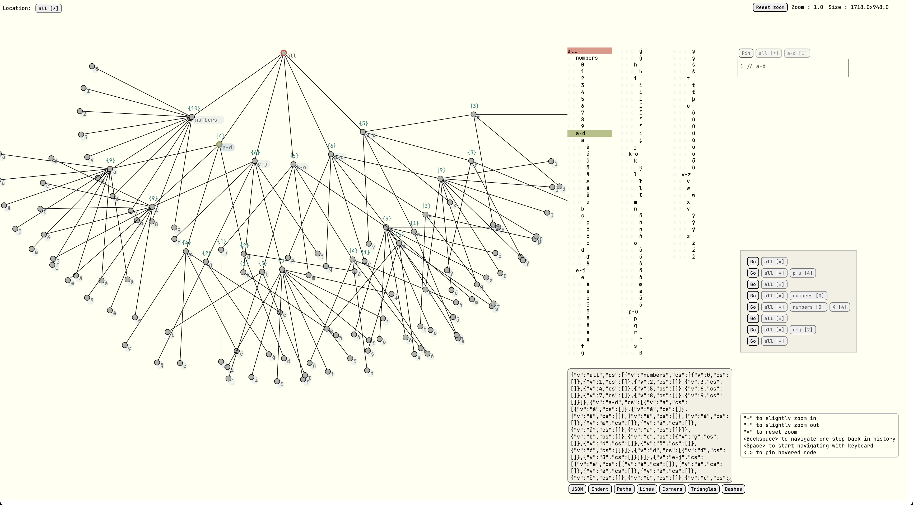
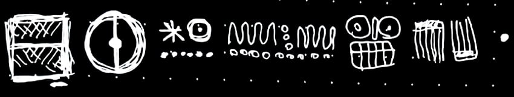
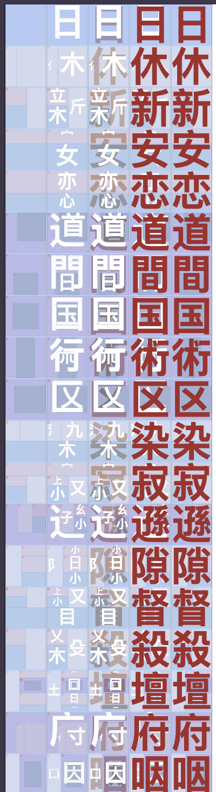
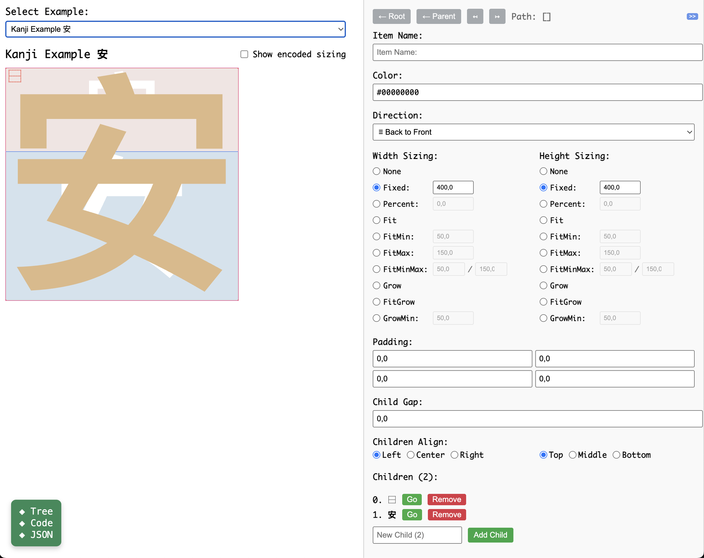
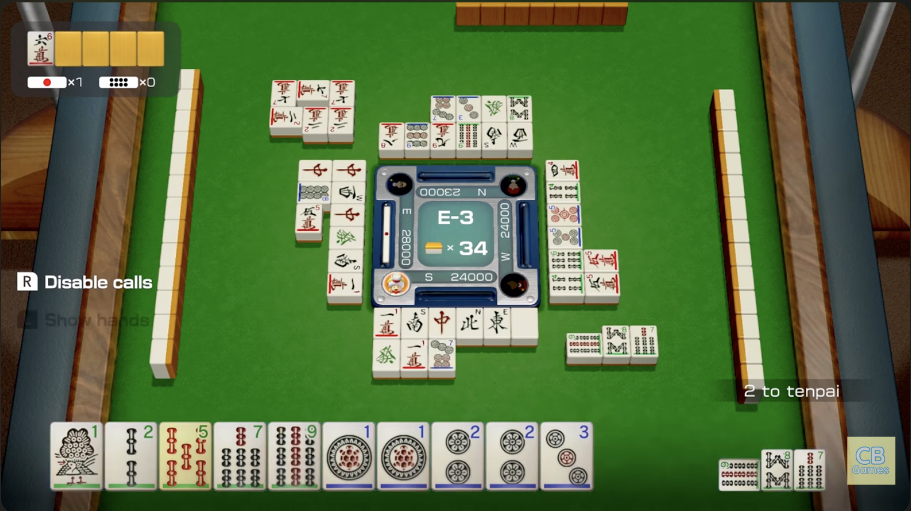
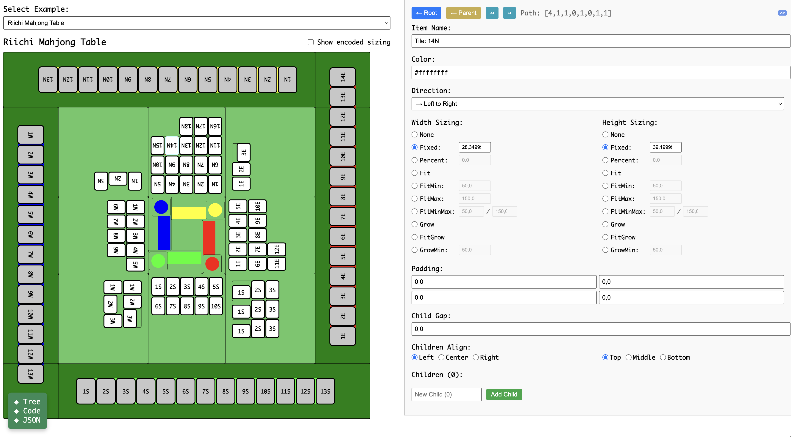
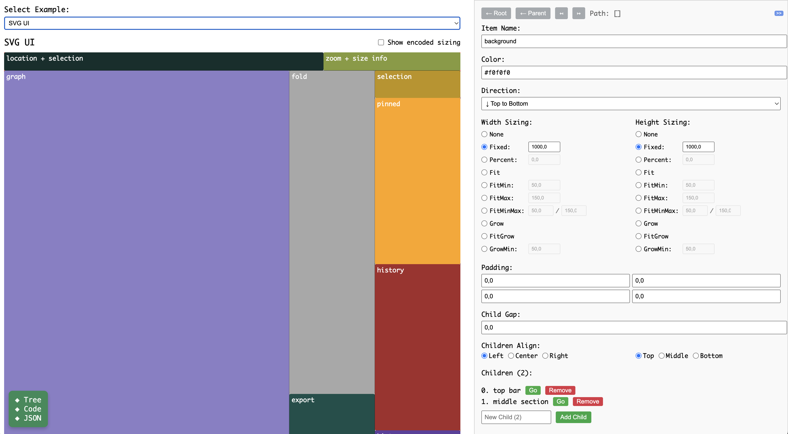

- Table of Contents
  - [Introduction](#introduction)
  - [Clay UI as an inspiration](#clay-ui-as-an-inspiration)
  - [Play API](#play-api)
    - [`Play` Types and Functions](#play-types-and-functions)
    - [Layout definition](#layout-definition)
  - [The Constructor](#the-constructor)
  - [The Algorithm](#the-algorithm)
  - [Examples](#examples)
    - [Kanji](#kanji)
      - [Kanji. A single sole character / radical:](#kanji-a-single-sole-character-radical)
      - [Kanji. Two (or more) characters aside:](#kanji-two-or-more-characters-aside)
      - [Kanji. Two (or more) characters above each other:](#kanji-two-or-more-characters-above-each-other)
      - [Kanji. The enclosure:](#kanji-the-enclosure)
    - [The Riichi mahjong table](#the-riichi-mahjong-table)
    - [SVG Tree Viewer](#svg-tree-viewer)
  - [Outro](#outro)


## Introduction

Now that most of my latest projects are written in PureScript[^1], my favorite language for development for several years already, I noticed that I am developing a bunch of web apps with user interfaces of different complexity:


Let me list some of the details from these examples:

* Noodle — visual programming platform, where:
	* it is possible to open many side panels: documentation, action history, log, and so on;
	* there is a library of node families;
	* there as well is status bar with several cells;
	* there is patch area where all the nodes are layed out;
	* and all the nodes have their own structure which I want to have modular;
		 * the node could be vertical: inlets on the top, outlets on the bottom;
		 * the node could be horizontal: inlets on the left, outlets on the right;
	* there are several stacked layers: canvas in the background, SVG main area as a layer in the middle, HTML layer on top, and recently I have added one more canvas on top for the node bodies;
	* not to mention that to find a free space for a new node, we could also need a smart layouting system intended just for nodes;


[Noodle at Github](https://github.com/shamansir/noodle)

* Tree graph explorer, to visualize the many kinds of tree-structured data I have; Sometimes I store UI dependencies in a graph, sometimes I keep my book library organized as a tree, where a shelf or an author's name first letters can represent a node; It has these optional panels:

	* The tree itself;
	* The pinned nodes area, to keep an eye on the specific tree nodes (they can be complex interactive components by themselves);
	* The area where I can see a tree in its plain representation for easier navigation, where the selected nodes are highlighted;
	* The history of the visited paths, so I would be able to return to them later;
	* Current location and current selection, since it is heavily based on keyboard navigation;
	* Zoom panel;
	* The export area, for JSON and other formats preview;
	* ...



...and counting. I also plan to revive some older projects, and they also have many panels and subpanels. So I felt an acute need to ease the calculation of all the positioning, because for every small part the position needs to be calculated and I want them responsive. And with PureScript we're not having Swift UI-like constructors... yet.

[SVG Tree at Github](https://github.com/shamansir/purescript-yoga-tree-svg)

## Clay UI as an inspiration

Almost in the same moments when this need was most desperate in my mind, YouTube happened to suggest me the video about Clay UI : the UI layouting library for C++ with beautifully simple and consice algorithm (yes, in C++) and it was all explained in all details in full in 40 minutes.


[How Clay's UI Layout Algorithm Works by Nic Barker](https://www.youtube.com/watch?v=by9lQvpvMIc)

So I was definitely inspired, I love to discover the easier parts in what was considered complex before, and O decided to translate this algorithm to pure FP version, of course it turned out to be an interesting thought-trainer by itself, and considering the problems I mentioned above, the challenge, when resolved, tended to grow very helpful and useful for my cause.

While C++ code is usually imperative, pure FP seem to require the completely perpendicular approach... partly it is true, the code is very different, but Nic, the author of Clay UI is so talented that his ideas are universal for almost any programming approach, and they could be layed out over FP concepts like one would considered they were there from the start, we have folding and recursion out of the box for our help, but the order of steps and mathematics are the same:

    * fit sizing reverse-breadth-first (from leaves to the root);
    * then calculate grow sizing breadth-first (from the root to the leaves);
    * then apply positions having the sizes already (in any direction);

NB: It is worth mentioning that one of the core features of Clay is measuring text size in any font, so that it can be layed out correctly. In C++ it is an uncommon but needed feature, but in front-end web development we have our own ways for that: nowadays browser engines help us, but not a long time ago we had to pre-render the text in some HTML element that is invisible to the user and measuring it. So I decided to omit this part, which is probably better to implement through JavaScript FFI.

I can't say that it was _very_ easy, but still it was much was easier than I expected, to implement all this logic. And it also turned out to be just [around 300 lines of code](https://github.com/shamansir/purescript-play/blob/main/src/Play/Layout.purs#L27), even including empty lines, documentation and type definitions. I planned to use Claude/Copilot only on the last stages for writing the tests and clarifying the algorithm with documentation, and indeed I did enable it only after implementing the core part, but in the end we developed the UI Constructor as well as some quick encoding system for layouts together, and also AI helped me later with fixing some hardly noticable issues regarding children alignment and percentage positioning in deeper structures.

The UI of the constructor is a bit bulky, there are many inline CSS styles there, but there are many features that could help you draft or build your layout beforehand, and generate the code to fill it in with the values later.

...And I named the library Play, because no other word came to my mind in attempts to combine PureScript and Clay. Also, I suppose with Japanese pronounciation of this word could sound very similar to "Pure". ChatGPT, do you know any better? Picklay? Purée? Hooray?...

...Hey, may you would like to have some fun already, so there is a beforementioned layout constructor for you to _play_ with: [https://shamansir.github.io/purescript-play/constructor.html](https://shamansir.github.io/purescript-play/constructor.html)


## Play API

The idea is to let user fill in a polymorphic parameter `a` with any type they want: `Play a` can be `Play Int`, `Play String`, `Play Color`, `Play UIPart`, `Play Key`, `Play Character`,  `Play Sonet`, `Play HalfLife3UI`, `Play (Play Whatever)`...

PureScript allows you to define almost any operator you want, so I decided to have `~*`for chaining, which is actually just an alias for `#`, so you can use any you prefer, just don't mix them in the same code. Here's the example of a defintion:

```haskell
data MenuItem
   = Root
   | Title String
   | Icon

data ClayMenu
    = Root
    | Item MenuItem

menuItem :: String -> Play ClayMenu
menuItem itemTitle =
    Play.i (Item Root)
        ~* Play.widthGrow
        ~* Play.heightFit
        ~* Play.leftToRight
        ~* (Play.padding $ Play.all 3.0)
        ~* Play.with
        [ Play.i (Item $ Title itemTitle)
            ~* Play.widthGrow
            ~* Play.height 60.0
        , Play.i (Item Icon)
            ~* Play.width 60.0
            ~* Play.height 60.0
        ]


menuDef :: Play ClayMenu
menuDef =
    Play.i Root
        ~* Play.width 250.0
        ~* Play.heightFit
        ~* (Play.padding $ Play.all 5.0)
        ~* Play.topToBottom
        ~* Play.childGap 5.0
        ~* Play.with (menuItem <$>
                        [ "Copy", "Paste", "Delete", "Spell Check", "Dictionary", "Comment" ])
    :: Example ClayMenu

```

You can find the examples [in the sources](https://github.com/shamansir/purescript-play/tree/main/test/Demo/Examples) of the Constructor as well as [in the test spec](https://github.com/shamansir/purescript-play/blob/main/test/Test/Spec/Layout.purs)[^2], there should be a fitting one for almost any case! :)



### `Play` Types and Functions

`Play a` contains all the layout definitions, which side of the container / cell is fixed in size, or grows, or if it fits its children (more on that later), but they are not layed out yet (don't lay off, better lay out!).

For that, there's `Layout a`, which, as you may suggest, stores all the items layed out strictly following these definitions, having their positions and dimensions calculated.

So, when you have defined the logic of how your UI parts fit and grow, call the `layout` function, which is a verb in this case, and you'll have the calculated rectangles in place:

```haskell
menuLayout :: Play.Layout ClayMenu
menuLayout = Play.layout menuDef
```

Since, as you may have noticed, I really like tree structures, both of those are just trees under the hood:

```haskell
type WithDef a = { v :: a, def :: Def }
type WithDefRect a = { v :: a, def :: Def, rect :: Rect }

data Play a = Play (Tree (PT.WithDef a))
data Layout a = Layout (Tree (PT.WithDefAndRect a))

layout :: forall a. Play a -> Layout a
layout = toTree >>> Layout.layoutTree >>> Layout
```

`Def` is just the configuration, while `Rect` contains both position and size of every element. You may convert the `Layout a` to either a tree or a flattened array, what is better fits your needs:

```haskell
layoutToTree :: forall a. Layout a -> Tree (PT.WithRect a)

flattenLayout :: forall a. Layout a -> Array (PT.WithRect a)
```

The calculations are already made, so the order is not important anymore, all the positions and dimensions are there, so you lose nothing even with a flat array, you may just map over it in the UI renderer:

```haskell
let
    windowSize = window.size
    myLayout = Play.layout $ myUI windowSize -- your layout could depend on the window size, but it's not obligatory;
in
    H.div
        [ H.style $ Position Relative ]
        $ renderItem <$> Play.flattenLayout myLayout
    where
        renderItem :: PT.WithDefAndRect a -> Html _
        renderItem { rect, v } =
            H.div
              [ H.style $ Position Absolute <> Left rect.pos.x <> Top rect.pos.y ] -- I usually use SVG so I translate `Svg.g [] [...]` to the position
              $ case v of
                  Root -> ...
                  Item (Title title) -> ...
                  Item (Icon url) -> ...


```

If you need to keep parent-child relations for something else, I recommend prefer using `Play a` structure over `Layout a`, however once again those both are just `Tree a` in disguise.

So, once more, this `a` can be anything, for example in case of Noodle node inner layout I have `Play NodePart` where `NodePart` is defined this way:

```
data NodePart
    = Background
    ...
    | Title
    | BodyBg
    | BodyContent
    | Inlets
    | Outlets
    | Inlet Int
    | InletName Int String
    | InletConnector Int
    | Outlet Int
    | OutletName Int
    | OutletConnector Int
    | Buttons
    | Button Remove
    | Button Collapse
    ...
```

You may find even more examples later in the post.


### Layout definition

So, here's how you can define your layout:

Any cell can have its orientation either:

* _Horizontal_ / _LeftToRight_ — width is the main axis, the children are aligned horizontally;
* _Vertical_ / _TopToBottom_ — height is the main axis, the children are aligned vertically;
* _ZAxis_ / _BackToFront_ - yes, just like the layered cake, I really wanted to have this in some particular cases so I implemented it as well;

Then, either width or height of any cell can either be:

* _Fixed_ to some exact pixel size;
* _Fit_ its children by this side: pack them and resize to the sum of their width or height;
* _Percentage_ amount of the corresponding side of its parent, overflow is allowed and cut by the rectangle of the parent;
* _Grow_, unless it meets the next child or its parent can not expand more on the right / to the bottom;
* _FitGrow_ — fit its children and only then grow to the right / to the bottom;
* _FitMin_ — fit the children but no less than given value in pixels, so if children take less requested space, the side will have this size anyway, otherwise it will fit them into a larger size;
* _FitMax_ — same, but no more than given value in pixels;
* _FitMinMax_ — if the children fit between the given range, use the actual value, or restrict it with the given bounds;
* _GrowMin_ - grow only if there's a minimum of space, else have this side zero;

There is an additional configuration possible for any cell:

* _Children Gap_ — constant space inserted between children;
* _Padding_ — padding on the inner sides of the cell, so that there is a space between the border and its children, can be a specific value for each side;
* _Alignment_ - how the children are aligned inside the cell if their size is smaller on the side of alignment, could be specified both horizontally (Left / Center / Right) and vertically (Top / Middle / Bottom);

Both of `Play` and `Layout` are functors and applicatives:

```haskell
type MyItem = { title :: String, textColor :: Color, background :: Color }

myUI :: Play MyItem
myUI = ....

jsonTree :: Play Json
jsonTree = toJson <$> myUI

positionedLabels :: Play.Layout String
positionedLabels = _.title <$> Play.layout myUI
```


## The Constructor

Together with Claude, we've developed for you [the Constructor](https://shamansir.github.io/purescript-play/constructor.html) which can ease creating layouts by making it visual instead of just code:


It can be not that easy to use though, however at least  we tried! :). There are several useful features we implemented:

* Full properties editor:
    * You may change any layout parameter of a cell;
    * Manage their children: add or remove them;
* Navigate over the tree:
    * By clicking on the cell in the example preview;
    * Using the buttons on the top of the properies editor;
    * In the Tree viewer, by clicking on the title of the item;
* View the Tree interactively:
    * You may collapse and expand branches in the Tree Viewer;
* Convert the layout:
    * to PureScript code as `Play String`, so that you can just copy-paste it when your layout is ready;
    * to JSON definition;
    * to YAML definition;
* Optional encoded sizing labels can help in debugging (however, if the item is in the background, you can't see them);
* No dark mode (_yet_);
* The selected example is stored in the URL;
* Kinda illustrates responsiveness of the layouts when you change the size of the root element...;

By enabling encoded sizing labels, you may get visual help on how your layout is structured.

Start with the _Blank UI_ example if you would like to experiment from scratch.

You can click blocks on the visual preview to edit their properties. Or, especially for the cases when the block is zero-size or hidden below being compltely covered by its children, you can  navigate using the Properties panel. For every child there is _Go_ button to switch to this child, and whene you're there, there are _Parent_ (which allows you to switch to the parent of this particular child) and _Root_ (which allows you to switch to the only one parent for all this layout) buttons. If they are both disabled, you're already at root. If _Parent_ is disabled, then you're on the top level.

There's another, third way, to navigate: If you open the _Code & Tree_ panel on the bottom side of the screen, there's a tab with fully navigatable tree. Just click on any leaf and there you have switched to it.

The first tab on this panel, _Code_,  contains the generated code for current layout.

Both tree view and code are instantly updated whenever you change something in the layout. Same way as the visual preview, obviously :).


## The Algorithm

At first I wanted to explain here [the algorithm](https://github.com/shamansir/purescript-play/blob/main/src/Play/Layout.purs#L27) in the very detail, but I really tried to make it self-explanatory and I hope I succeeded, however it could still be the topic for another article.


## Examples

You could've been bored enough to this point, so I decided to give you more examples and illustrate them with Kanji structure.


### Kanji

Kanji are japanese hieroglyphs and they can be recursive in a sense: they can be treated as a single whole characters or contain other kanji characters inside and still be treated as a whole. But [there are](https://www.laits.utexas.edu/japanese/joshu/kanji/kanji_radicals/radicals3.html) [only a few certain ways](https://www.kanjijump.com/browse/components) to lay them out:

* single character;
* top to bottom; no matter if there are two or three elements, the above element could be smaller than the element below it or vise versa; may be the middle element is in most cases larger than the others, because other way it wouldn't be beautiful and would be weird, and kanji are nothing about weird;
* left to right; the left element could be smaller than the right one or vise
versa, the same statements as for vertical axis could apply here;
* enclosing: where one larger element contains another smaller one and either wraps it around completely or wraps it at least from two connected sides;


[Image Source](https://www.laits.utexas.edu/japanese/joshu/kanji/kanji_radicals/radicals3.html)

It could be quite easy to implement, but languages and writing systems are a bit more natural than mathematical, so they tend to be unpredictable and suprising more often than solving an equation or proving a theorem. But always beatiful. As how leaves are disordered on the tree. Or may be there's pure order we aren't aware about, in search of this order we developed fractals or Wave Function Collapse algorithm or Neural Networks...

So the laying out process of the kanji could repeat some times, there could be enclosing of one element inside another and then this enclosing could be
attached to the left of other two elements.[^3]

The element of kanji that can be reused inside other characters is called _radical_. Not all of dozens of thousands kanji can be radicals, but only around 214. If we follow the book, then the number is exactly 214.

Becase Unicode tries to cover all the writing systems and tries to optimize the rendering algorithms whenever possible by finding the patterns of possible combinations of characters, they developed the system called [IDS](https://en.wikipedia.org/wiki/Ideographic_Description_Characters):


It defines all the possible known ways of combining radicals by doing what we love to do in functional programming: binary or ternary operators/functions are applied to the results of the calls of another operators/functions, and the arguments of these functions are the forementioned radicals.


[Image Source](https://codeberg.org/tonton-pixel/unicopedia-sinica)

Since we plan to stretch radicals in different ways and not always proportionally, for rendering we'll use the slabby font instead of a caligraphic one, or else the beauty will be completely broken.

Here's a separate page with all [the examples of these Kanji](https://shamansir.github.io/purescript-play/kanji.html) rendered using Play UI:



So lets finally define what we know with the code, our implementation would mirror the IDS machine, if you want, you make take a look at [the actual code behind this page](https://github.com/shamansir/purescript-play/blob/main/test/Demo/Examples/Kanji.purs):

```haskell
newtype KanjiPart = KanjiP String -- we store the radical char here

data KanjiOp
    = Single KanjiPart
    | LeftToRight
        { left :: KanjiOp, right :: KanjiOp }
        { rate :: Number }
    | TopToBottom
        { top :: KanjiOp, bottom :: KanjiOp }
        { rate :: Number }
    | Surround
        SurroundKind
        { inside :: KanjiOp, surround :: KanjiOp }
        { rateX :: Number, rateY :: Number }


data SurroundKind
    = Full
    | FromAbove
    | FromBelow
    | FromLeft
    | FromRight
    | FromUpperLeft
    | FromUpperRight
    | FromLowerLeft
    | Inbetween
```

The difference is that we also remember the rate — the proportion between how much more one radical takes than its pair in a space of `1.0`. To represent a kanji as triplets, we'll just add a pair to an element, like in pure FP. Oh wait...

So now we have a universal recursive function:

```haskell
toPlaySpecAt :: _ -> KanjiOp -> Play KanjiItem
toPlaySpecAt posKey = case _ of
    Single kanji -> ...
    LeftToRight { left, right } { rate } -> ...
    TopToBottom { top, bottom } { rate } -> ...
    Surround kind { inside, surround } { rateX, rateY } -> ...
```

The snippets below are the parts of this function. You may find these examples separately in the constructor, just look for the ones titled _Kanji Example ..._:



#### Kanji. A single sole character / radical:

The definition for a single character is as easy as this:

```haskell
Play.i (AKanji kanji posKey)
        ~* Play.widthGrow
        ~* Play.heightGrow
```

#### Kanji. Two (or more) characters aside:

When we need to position two sub-parts together, we need to decide how they share the space, usually one dominates over the other:

```haskell
Play.i (OpRoot OpLeftToRight)
    ~* Play.widthGrow
    ~* Play.heightGrow
    ~* Play.leftToRight
    ~* Play.with
        [ toPlaySpecAt KLeft left
            ~* Play.widthPercent (Play.pct rate)
            ~* Play.heightGrow
        , toPlaySpecAt KRight right
            ~* Play.widthPercent (Play.pct $ 1.0 - rate)
            ~* Play.heightGrow
        ]
```

#### Kanji. Two (or more) characters above each other:

It's the same as with horizontal axis, but vertical:

```haskell
Play.i (OpRoot OpTopToBottom)
    ~* Play.widthGrow
    ~* Play.heightGrow
    ~* Play.topToBottom
    ~* Play.with
        [ toPlaySpecAt KTop top
            ~* Play.widthGrow
            ~* Play.heightPercent (Play.pct rate)
        , toPlaySpecAt KBottom bottom
            ~* Play.widthGrow
            ~* Play.heightPercent (Play.pct $ 1.0 - rate)
        ]
```

#### Kanji. The enclosure:

This one is a bit more complicated:

```haskell
let
    insidePlay = toPlaySpecAt (KInside kind) inside
    surroundPlay = toPlaySpecAt (KSurround kind) surround
    construct alignHorz alignVert =
        Play.i (OpRoot $ OpSurround kind)
            ~* Play.widthGrow
            ~* Play.heightGrow
            ~* Play.backToFront
            ~* Play.with
                [ surroundPlay
                , Play.i Stub
                    ~* Play.widthGrow
                    ~* Play.heightGrow
                    ~* alignHorz
                    ~* alignVert
                    ~* Play.with
                        [ Play.i (OpRoot $ OpSurroundInside kind)
                            ~* Play.widthPercent  (Play.pct $ 1.0 - rateX)
                            ~* Play.heightPercent (Play.pct $ 1.0 - rateY)
                            ~* Play.with [ insidePlay ]
                        ]
                ]
in case kind of
    Full ->
        construct     Play.alignCenter    Play.alignMiddle
    FromAbove ->
        construct     Play.alignCenter    Play.alignBottom
    FromLeft ->
        construct     Play.alignRight     Play.alignMiddle
    FromRight ->
        construct     Play.alignLeft      Play.alignMiddle
    FromBelow ->
        construct     Play.alignCenter    Play.alignTop
    FromUpperLeft ->
        construct     Play.alignRight     Play.alignBottom
    FromUpperRight ->
        construct     Play.alignLeft      Play.alignBottom
    FromLowerLeft ->
        construct     Play.alignRight     Play.alignTop
    Inbetween ->
        construct     Play.alignCenter    Play.alignTop
```


### The Riichi mahjong table

As you may have noticed, Japanese culture inspires truly inspires people, so let's stick with it a bit more. There is a tabletop game called [_Riichi Mahjong_](https://en.wikipedia.org/wiki/Japanese_mahjong) in Japan, of which can think of something like Poker card game variation (what was earlier?), but the all the cards are made from dragon teeth rather than paper.

You may have noticed people playing in in some Cyberpunk movies or _Umbrella Academy_ TV series or somewhere else... I am lazily trying to learn the rules already for more than a year (a perfect game for playing in Corona times with your household), for example with the help of [this three-hour-long video](https://www.youtube.com/watch?v=hlnC2rgIPrc).

So I decided that it could also be fun to lay out the table for the game. There are many variants of Mahjong games for your phone now, but be aware, it could be a casino-like experience:


[Source of the image](https://www.youtube.com/watch?v=mUYQyUa2PoU)

I decided that I would like to implement the layout of the table from Nintendo Switch _51 Worldwide Classics_:



[Source of the image](https://www.youtube.com/watch?v=tvQiCNnLC8k)

In my case it's not that beautiful and not 3D but the positions are there:




It's where _BackToFront_ direction and percentage fitting helped a lot, because there are many parts that is easier to implement when they overlap each other. It would be an insidious move of mine if I would include the full code of this layout (even considering that it is woven from several reusable functions), so I will just leave the link to the source code for you: [The Riichi Mahjong Table layout](https://github.com/shamansir/purescript-play/blob/main/test/Demo/Examples/RiichiMahjong.purs)


### SVG Tree Viewer

Let the last example be a more laconic code, so here's the mentioned SVG Tree editor layout ( [source code](https://github.com/shamansir/purescript-play/blob/main/test/Demo/Examples/SvgTree.purs) ):




## Outro

With this article I hope to attract more attention to the languages like [PureScript](https://www.purescript.org/), or [Unison](https://www.unison-lang.org/) or [LEAN](https://lean-lang.org/), or [Haskell](https://www.haskell.org/) or [Elm](https://elm-lang.org/) and its descendants, because they not only bring mathematical beauty in the world (I say it from the position of the guy who totally didn't like maths at school, though gladly read books from Martin Gardner or Lewis Carroll [about Logic](https://en.wikipedia.org/wiki/The_Game_of_Logic)), but also the code written using them is stable, easy to reason, and brings joy.

--------

[^1]: which is (I please you) not to be confused with TypeScript, but rather
be confused with a kind of non-lazy Haskell for web development;

[^2]: notice that for the tests specs I developed the quick encoding of the layout parameters (which is itself covered with tests), this kind of encoding is also shown in the constructor, and if you find it useful, you are free to use it!

[^3]: some more resources about kanji:

     * https://kanjiheatmap.com/
     * https://jd4gd.com/kanji_components.html
     * https://kanjisense.com/browse/atomic-components
     * https://www.cnblogs.com/Stareven233/p/18782825
     * https://codeberg.org/tonton-pixel/unicopedia-sinica
     * https://blog.lingodeer.com/kanji-radicals/
     * https://www.sljfaq.org/afaq/encodings.html
     * https://magazeta.com/cjk-and-unicode