# Music

### Radical {#radical}

([SC](https://soundcloud.com/shamansir/sets/radical), [SP](https://open.spotify.com/album/0qpokgmHetmOntJpxIRFei))

*as* Elektrokiłka

**Release Date**: 14 February 2023

**Length**: 01:37:31

**Tracks**:

  - {.align-middle .mr-2} **Untitled** 09:07 /2023/ ([SC](https://soundcloud.com/shamansir/untitled?in=shamansir/sets/radical), [SP](https://open.spotify.com/track/5kR25DFtsDYMYkdTdEymOq))
  - 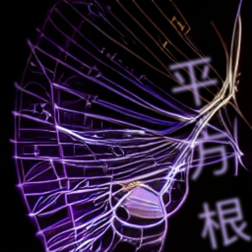{.align-middle .mr-2} **Radical** 06:20 /2023/ ([SC](https://soundcloud.com/shamansir/radical?in=shamansir/sets/radical), [SP](https://open.spotify.com/track/nsynXQC213r6FL3y8RzuU))
  - 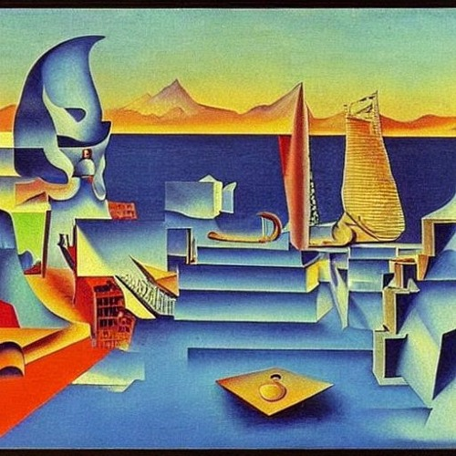{.align-middle .mr-2} **横浜** 04:11 /2023/ ([SC](https://soundcloud.com/shamansir/yokohama?in=shamansir/sets/radical), [SP](https://open.spotify.com/track/04cNg0HzIQ7Hql4A4sQu67))
  - 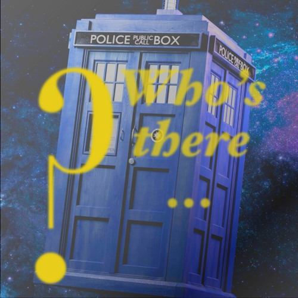{.align-middle .mr-2} **who's there** 16:29 /2023/ ([SC](https://soundcloud.com/shamansir/whos-there?in=shamansir/sets/radical), [SP](https://open.spotify.com/track/3AldkPLDCIqxO693Li392j))
  - {.align-middle .mr-2} **Georginen (ver. 1)** 22:06 /2023/ ([SC](https://soundcloud.com/shamansir/georginen?in=shamansir/sets/radical), [SP](https://open.spotify.com/track/5fLkzqPeWCsh14Qhsi2gjt))
  - 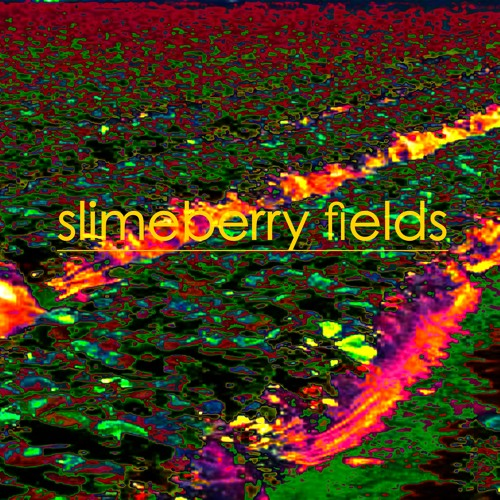{.align-middle .mr-2} **Slimeberry Fields** 12:03 /2023/ ([SC](https://soundcloud.com/shamansir/slimeberry-fields?in=shamansir/sets/radical), [SP](https://open.spotify.com/track/3ph7k6C6xqpkah2Z5r4xcK))
  - 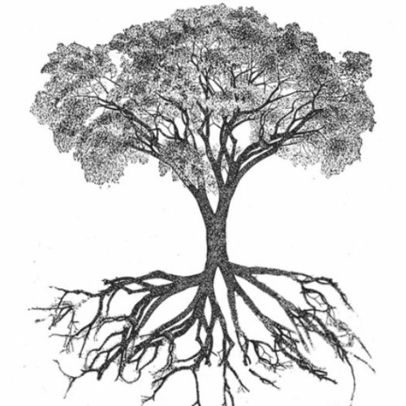{.align-middle .mr-2} **Rhizome** 01:57 /2023/ ([SC](https://soundcloud.com/shamansir/rhizome?in=shamansir/sets/radical), [SP](https://open.spotify.com/track/254rgacexLHI3T4kY9u0Tn))
  - {.align-middle .mr-2} **京都十二** 08:04 /2023/ ([SC](https://soundcloud.com/shamansir/kyoto-12?in=shamansir/sets/radical), [SP](https://open.spotify.com/track/7bGNplEFtvBFsc80Dwrrfi))
  - {.align-middle .mr-2} **The Chemical Sisters** 05:11 /2023/ ([SC](https://soundcloud.com/shamansir/the-chemical-sisters?in=shamansir/sets/radical), [SP](https://open.spotify.com/track/04pmSgblIOSpg6IOxipL7N))
  - {.align-middle .mr-2} **Pfin Freaks** 02:30 /2023/ ([SC](https://soundcloud.com/shamansir/pfin-freaks?in=shamansir/sets/radical), [SP](https://open.spotify.com/track/6QmsJucvpDwQD1Mc6rAh3h))
  - 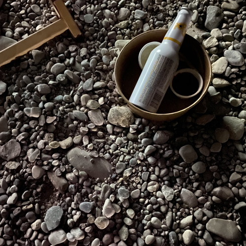{.align-middle .mr-2} **Atomic Neverland** 09:33 /2020/ ([SC](https://soundcloud.com/shamansir/atomic-neverland?in=shamansir/sets/radical), [SP](https://open.spotify.com/track/0cRPTx0Pfgiy3n5K5rSgdK), [SP](https://open.spotify.com/track/2CR0ZGO7OKPzQ1JNHvj3Pj))
### München {#muenchen}

([SC](https://soundcloud.com/shamansir/sets/muenchen), [SP](https://open.spotify.com/album/6gecLMZQiCCLVZ0kMWUt12))

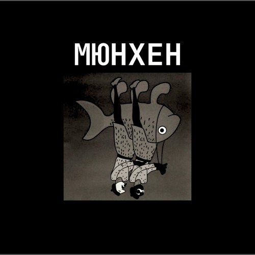

*with* The Unriders

**Release Date**: 11 May 2020

**Length**: 01:01:59

**Tracks**:

  - {.align-middle .mr-2} **Аутро** 02:50 /2020/ ([SC](https://soundcloud.com/shamansir/the-riders-autro?in=shamansir/sets/muenchen), [SP](https://open.spotify.com/track/2c8PvQlzCdjNpLDJQDMKH6)) *with* The Unriders
  - 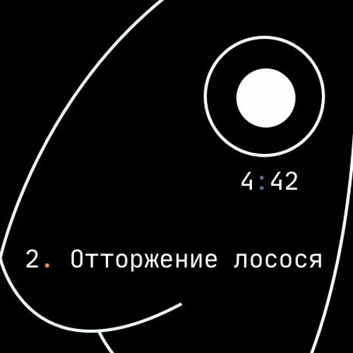{.align-middle .mr-2} **Отторжение Лосося** 04:42 /2020/ ([SC](https://soundcloud.com/shamansir/wpa-salmon-rejection?in=shamansir/sets/muenchen), [SP](https://open.spotify.com/track/7ETAJCAjIIV5T9CeZU113T)) *with* The Unriders
  - 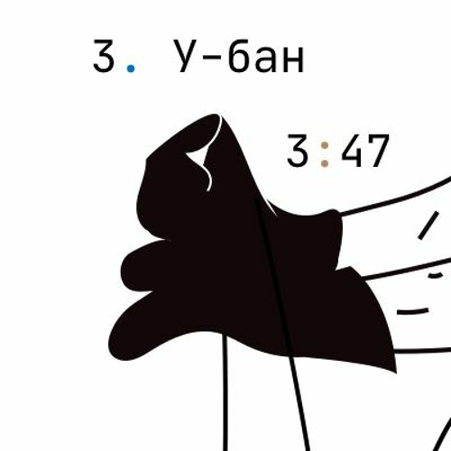{.align-middle .mr-2} **У-Бан** 03:47 /2020/ ([SC](https://soundcloud.com/shamansir/wpa-u-bahn?in=shamansir/sets/muenchen), [SP](https://open.spotify.com/track/73Og5xc4lSv1Ws4aEV7gXE)) *with* The Unriders
  - 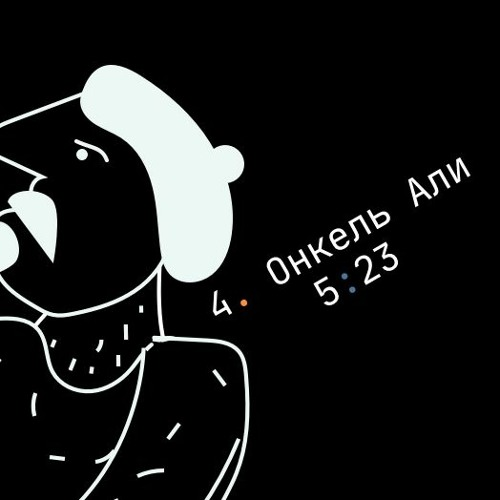{.align-middle .mr-2} **Онкель Али** 05:23 /2020/ ([SC](https://soundcloud.com/shamansir/onkel-ali?in=shamansir/sets/muenchen), [SP](https://open.spotify.com/track/7JAUNrqSZqCMlLe40mXhiR)) *with* The Unriders
  - 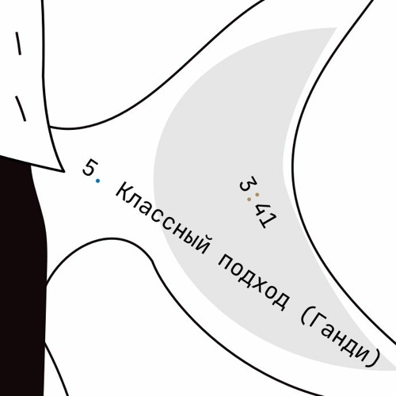{.align-middle .mr-2} **Классный Подход (Ганди)** 03:41 /2020/ ([SC](https://soundcloud.com/shamansir/ghandi?in=shamansir/sets/muenchen), [SP](https://open.spotify.com/track/7rJevjcasjadMDBAanPAul)) *with* The Unriders
  - 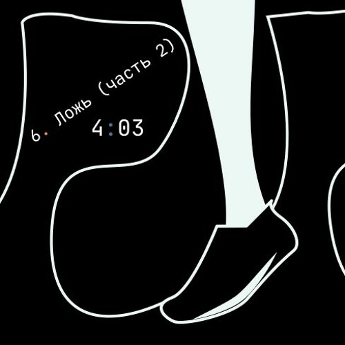{.align-middle .mr-2} **Ложь (часть 2)** 04:03 /2020/ ([SC](https://soundcloud.com/shamansir/lozh-pt-2?in=shamansir/sets/muenchen), [SP](https://open.spotify.com/track/0GpObinylbFrN8uUCT1uqo)) *with* The Unriders
  - 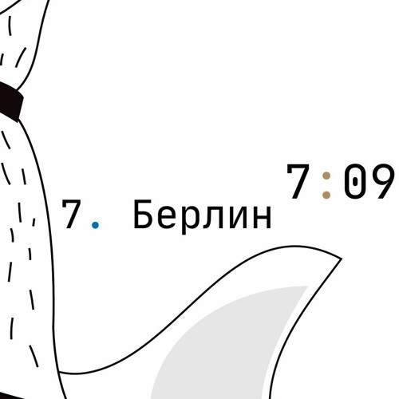{.align-middle .mr-2} **Берлин** 07:09 /2020/ ([SC](https://soundcloud.com/shamansir/wpa-berlin?in=shamansir/sets/muenchen)) *with* The Unriders
  - 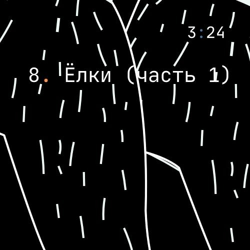{.align-middle .mr-2} **Ёлки (часть 1)** 03:24 /2020/ ([SC](https://soundcloud.com/shamansir/the-unriders-yellki?in=shamansir/sets/muenchen), [SP](https://open.spotify.com/track/04PJhPoCdfxs8iCZ8EGCmr)) *with* The Unriders
  - 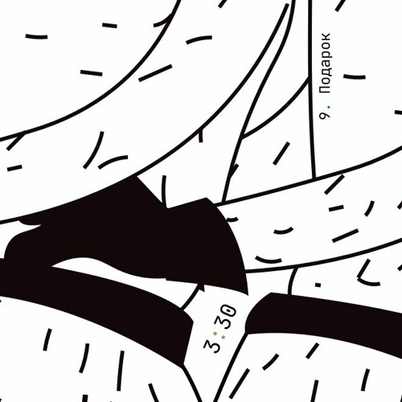{.align-middle .mr-2} **Подарок** 03:30 /2020/ ([SC](https://soundcloud.com/shamansir/podarok?in=shamansir/sets/muenchen), [SP](https://open.spotify.com/track/71rTSdEVMmw1shAcfWn15o)) *with* The Unriders
  - 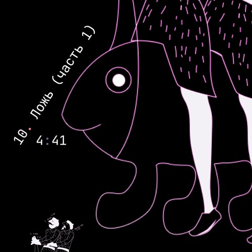{.align-middle .mr-2} **Ложь (часть 1)** 04:41 /2020/ ([SC](https://soundcloud.com/shamansir/lozh-part-1?in=shamansir/sets/muenchen), [SP](https://open.spotify.com/track/3DwkoAGhze8aBxSrrD0BJQ)) *with* The Unriders
  - {.align-middle .mr-2} **Salmon Reject Riddim** 02:46 /2020/ ([SC](https://soundcloud.com/shamansir/salmon-reject-riddim-by-superlazin?in=shamansir/sets/muenchen)) *with* The Unriders
  - 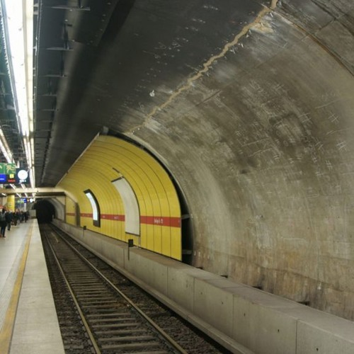{.align-middle .mr-2} **U-Bahn (Garage Version)** 03:47 /2020/ ([SC](https://soundcloud.com/shamansir/wpa-u-bahn-garage?in=shamansir/sets/muenchen)) *with* The Riders
  - {.align-middle .mr-2} **Классный подход (Ганди) (Garage Version)** 03:44 /2020/ ([SC](https://soundcloud.com/shamansir/ghandi-garage?in=shamansir/sets/muenchen)) *with* The Riders
  - 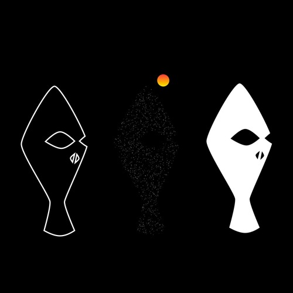{.align-middle .mr-2} **Отторжение Лосося (Garage Version)** 04:36 /2020/ ([SC](https://soundcloud.com/shamansir/wpa-salmon-rejection-garage?in=shamansir/sets/muenchen)) *with* The Riders
  - {.align-middle .mr-2} **Вечерний Алкоголь II** 03:56 /2020/ ([SC](https://soundcloud.com/shamansir/wpa-alcohol-afterdark-ii?in=shamansir/sets/muenchen)) *with* W.P.A.
### Mozart is a Trickster (EP) {#mozart-ep}

([SC](https://soundcloud.com/shamansir/sets/mozart-is-a-trickster-ep-2018))

*as* shaman.sir

**Release Date**: 18 January 2018

**Length**: 15:47

**Tracks**:

  - 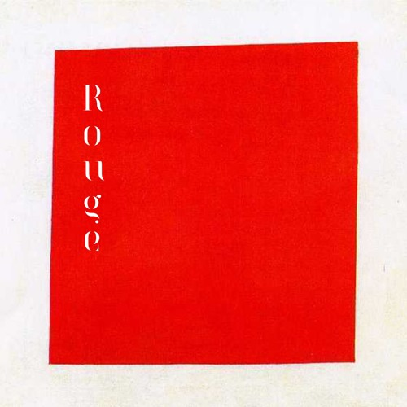{.align-middle .mr-2} **Rouge** 03:22 /2018/ ([SC](https://soundcloud.com/shamansir/rouge?in=shamansir/sets/mozart-ep), [SP](https://open.spotify.com/track/1dYfIUJ0NJRxvoXre3O1DH))
  - {.align-middle .mr-2} **Mozart is a Trickster** 03:26 /2018/ ([SC](https://soundcloud.com/shamansir/mozart-is-a-trickster?in=shamansir/sets/mozart-ep), [SP](https://open.spotify.com/track/0cQ8KjU8GmEJ7qNWAyYtS3))
  - {.align-middle .mr-2} **SwInKh** 04:41 /2018/ ([SC](https://soundcloud.com/shamansir/swinkh?in=shamansir/sets/mozart-ep), [SP](https://open.spotify.com/track/2PE9JT0WstL8Taku3FFQNo))
  - 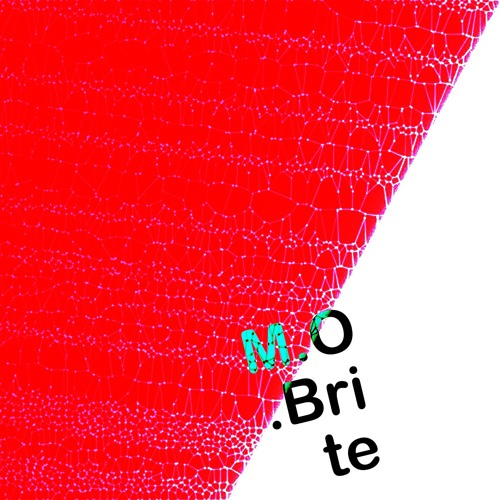{.align-middle .mr-2} **M.O. Brite** 04:18 /2018/ ([SC](https://soundcloud.com/shamansir/mobrite?in=shamansir/sets/mozart-ep), [SP](https://open.spotify.com/track/3bU7yrCeeePf0A1AXOTMAV))
### Back EP B-Sides {#back-ep-b-sides}

([SC](https://soundcloud.com/shamansir/sets/back-b-sides))

*as* shaman.sir

**Release Date**: 11 October 2015

**Length**: 01:03:46

**Tracks**:

  -  **Monad. Triptych** 12:16 /2016/ ([SC](https://soundcloud.com/shamansir/monad-tryptich?in=shamansir/sets/back-ep-b-sides), [SP](https://open.spotify.com/track/2XSOrJiB23oPWVoIxEoLPK))
  -  **Floyd Experiment (Edit)** 04:54 /2016/ ([SC](https://soundcloud.com/shamansir/floyd-experiment-edit?in=shamansir/sets/back-ep-b-sides), [SP](https://open.spotify.com/track/1tyOoFjOry901hdXK4shvx))
  -  **Intrincado** 04:47 /2016/ ([SC](https://soundcloud.com/shamansir/intrincado?in=shamansir/sets/back-ep-b-sides), [SP](https://open.spotify.com/track/7kagqILYYhP0epFJTzkOxJ))
  -  **Winter 'mphony** 03:54 /2016/ ([SC](https://soundcloud.com/shamansir/winter-mphony?in=shamansir/sets/back-ep-b-sides))
  -  **Winter 'mphony II (Edit)** 03:00 /2016/ ([SC](https://soundcloud.com/shamansir/winter-mphony-ii-edit?in=shamansir/sets/back-ep-b-sides))
  -  **Bleed (Long)** 01:48 /2016/ ([SC](https://soundcloud.com/shamansir/bleed-long?in=shamansir/sets/back-ep-b-sides))
  -  **The Chemical Sisters** 05:11 /2016/ ([SC](https://soundcloud.com/shamansir/the-chemical-sisters?in=shamansir/sets/back-ep-b-sides), [SP](https://open.spotify.com/track/3fcmCYiivUSRheHAVBWGkh))
  -  **∀∈Jazz (Draft)** 05:36 /2016/ ([SC](https://soundcloud.com/shamansir/all-that-jazz-draft?in=shamansir/sets/back-ep-b-sides))
  -  **∀∈Jazz** 06:32 /2016/ ([SC](https://soundcloud.com/shamansir/all-that-jazz?in=shamansir/sets/back-ep-b-sides), [SP](https://open.spotify.com/track/7M6GueRRGRZPHdjWJOrLxQ))
  -  **Sonata** 07:15 /2016/ ([SC](https://soundcloud.com/shamansir/sonata?in=shamansir/sets/back-ep-b-sides))
  -  **MixDown - 11** 03:29 /2016/ ([SC](https://soundcloud.com/shamansir/mixdown-11?in=shamansir/sets/back-ep-b-sides))
  -  **The Chemical Sisters (Edit)** 05:04 /2016/ ([SC](https://soundcloud.com/shamansir/the-chemical-brothers-edit?in=shamansir/sets/back-ep-b-sides))
### Back EP {#back-ep}

([SC](https://soundcloud.com/shamansir/sets/back-ep))

*as* shaman.sir

**Release Date**: 16 November 2013

**Length**: 23:53

**Tracks**:

  -  **Apollo** 05:16 /2013/ ([SC](https://soundcloud.com/shamansir/apollo?in=shamansir/sets/back-ep), [SP](https://open.spotify.com/track/7qSicw9Oh9usBK5duFZyID))
  -  **Monad (Edit'n'Cut)** 04:11 /2013/ ([SC](https://soundcloud.com/shamansir/monad-edit-n-cut?in=shamansir/sets/back-ep), [SP](https://open.spotify.com/track/4UfkaNQmqGTlUcHKxc76dm))
  -  **Bebop** 04:32 /2013/ ([SC](https://soundcloud.com/shamansir/bebop?in=shamansir/sets/back-ep), [SP](https://open.spotify.com/track/1C0MI8syImmLMA7UEkw8Cl))
  -  **Floyd Experiment** 04:55 /2013/ ([SC](https://soundcloud.com/shamansir/floyd-experiment?in=shamansir/sets/back-ep))
  -  **Blood (Bleeding Fingers Contest)** 01:30 /2013/ ([SC](https://soundcloud.com/shamansir/blood?in=shamansir/sets/back-ep))
  -  **Mixdown-112** 03:29 /2013/ ([SC](https://soundcloud.com/shamansir/mixdown-112?in=shamansir/sets/back-ep))
### nanodisc {#nanodisc}

([SC](https://soundcloud.com/shamansir/sets/nanodisc))

*as* shaman.sir

**Release Date**: 1 October 2005

**Length**: 23:01

**Tracks**:

  -  **intro** 05:29 /2005/ ([SC](https://soundcloud.com/shamansir/nanodisc-intro?in=shamansir/sets/nanodisc))
  -  **beijing** 03:05 /2005/ ([SC](https://soundcloud.com/shamansir/beijing?in=shamansir/sets/nanodisc), [SP](https://open.spotify.com/track/4DMXuq801h6VcavfwPNgLq))
  -  **quadline** 06:48 /2005/ ([SC](https://soundcloud.com/shamansir/quadline?in=shamansir/sets/nanodisc))
  -  **nothin original** 05:29 /2005/ ([SC](https://soundcloud.com/shamansir/nothin-original?in=shamansir/sets/nanodisc))
  -  **intro wow** 02:10 /2005/ ([SC](https://soundcloud.com/shamansir/intro-wow?in=shamansir/sets/nanodisc))
### sh0ck {#shock}

([SC](https://soundcloud.com/shamansir/sets/sh0ck))

*as* shaman.sir

**Release Date**: 2 December 2003

**Length**: 02:30:31

**Tracks**:

  -  **Intro** 05:15 /2003/ ([SC](https://soundcloud.com/shamansir/sh0ck-intro?in=shamansir/sets/shock))
  -  **563rd Dimensions Cross** 09:49 /2003/ ([SC](https://soundcloud.com/shamansir/563rd-dimensions-cross?in=shamansir/sets/shock), [SP](https://open.spotify.com/track/56AVRLIDyQR2OaFq5FYtEb))
  -  **Loop Mode** 10:31 /2003/ ([SC](https://soundcloud.com/shamansir/loop-mode?in=shamansir/sets/shock))
  -  **Stars** 10:00 /2003/ ([SC](https://soundcloud.com/shamansir/stars?in=shamansir/sets/shock))
  -  **Da Club Rel@xin** 06:58 /2003/ ([SC](https://soundcloud.com/shamansir/da-club-relaxin?in=shamansir/sets/shock))
  -  **Dead Fish** 05:09 /2003/ ([SC](https://soundcloud.com/shamansir/dead-fisg?in=shamansir/sets/shock))
  -  **cooolah (Cold Juice)** 04:29 /2003/ ([SC](https://soundcloud.com/shamansir/cooollah?in=shamansir/sets/shock))
  -  **Coma** 02:19 /2003/ ([SC](https://soundcloud.com/shamansir/coma?in=shamansir/sets/shock), [SP](https://open.spotify.com/track/30o5w6O3mpN22H6MVp9V8X))
  -  **King of the Sleeptime** 05:01 /2003/ ([SC](https://soundcloud.com/shamansir/king-of-the-sleeptime?in=shamansir/sets/shock))
  -  **King of the Dreams** 04:44 /2003/ ([SC](https://soundcloud.com/shamansir/king-of-the-dreams?in=shamansir/sets/shock))
  -  **White Noise** 03:56 /2003/ ([SC](https://soundcloud.com/shamansir/white-noise?in=shamansir/sets/shock))
  -  **4get 'bout it** 05:01 /2003/ ([SC](https://soundcloud.com/shamansir/4get-bout-it?in=shamansir/sets/shock))
  -  **Samplicity Funk** 04:13 /2003/ ([SC](https://soundcloud.com/shamansir/samplicity-funk?in=shamansir/sets/shock))
  -  **Madness** 07:05 /2003/ ([SC](https://soundcloud.com/shamansir/madness?in=shamansir/sets/shock))
  -  **Whadda Hell** 04:54 /2003/ ([SC](https://soundcloud.com/shamansir/whadda-hell?in=shamansir/sets/shock))
  -  **Da Melody Craze** 12:48 /2003/ ([SC](https://soundcloud.com/shamansir/da-melody-craze?in=shamansir/sets/shock))
  -  **ReB00t** 04:32 /2003/ ([SC](https://soundcloud.com/shamansir/reboot?in=shamansir/sets/shock))
  -  **matriX** 03:54 /2003/ ([SC](https://soundcloud.com/shamansir/matrix?in=shamansir/sets/shock))
  -  **MIDI Man** 05:42 /2003/ ([SC](https://soundcloud.com/shamansir/midi-man?in=shamansir/sets/shock))
  -  **pure rave stage** 02:06 /2003/ ([SC](https://soundcloud.com/shamansir/pure-rave-stage?in=shamansir/sets/shock))
  -  **Outro** 04:54 /2003/ ([SC](https://soundcloud.com/shamansir/outro?in=shamansir/sets/shock))
  -  **B-Side: giag Rem** 01:23 /2003/ ([SC](https://soundcloud.com/shamansir/b-side-diag-riem?in=shamansir/sets/shock))
  -  **B-Side: Drummer Symphony** 05:33 /2003/ ([SC](https://soundcloud.com/shamansir/b-side-drummer-symphony?in=shamansir/sets/shock))
  -  **B-Side: Pure Rave Demo** 02:12 /2003/ ([SC](https://soundcloud.com/shamansir/b-side-pure-rave-demo?in=shamansir/sets/shock))
  -  **B-Side: Forward to the Past** 07:05 /2003/ ([SC](https://soundcloud.com/shamansir/b-side-forward-to-the-past?in=shamansir/sets/shock))
  -  **B-Side: Bass Life** 07:05 /2003/ ([SC](https://soundcloud.com/shamansir/b-side-bass-life?in=shamansir/sets/shock))
  -  **B-Side: check** 01:36 /2003/ ([SC](https://soundcloud.com/shamansir/b-side-check?in=shamansir/sets/shock))
  -  **B-Side: Coma was** 02:17 /2003/ ([SC](https://soundcloud.com/shamansir/coma-was?in=shamansir/sets/shock))
### ap-2021 {#ap-2021}

([SC](https://soundcloud.com/shamansir/sets/ap-2021))

*as* shaman.sir

**Release Date**: 2021

**Length**: 02:20:18

**Tracks**:

  - {.align-middle .mr-2} **ap-set-003** 39:48 /2021/ ([SC](https://soundcloud.com/shamansir/ap-set-003?in=shamansir/sets/ap-2021))
  - {.align-middle .mr-2} **ap-set-002** 17:39 /2021/ ([SC](https://soundcloud.com/shamansir/ap-set-002?in=shamansir/sets/ap-2021))
  - {.align-middle .mr-2} **ap-set-001** 01:13:18 /2021/ ([SC](https://soundcloud.com/shamansir/ap-set-001?in=shamansir/sets/ap-2021))
  - {.align-middle .mr-2} **Atomic Neverland** 09:33 /2020/ ([SC](https://soundcloud.com/shamansir/atomic-whatever?in=shamansir/sets/ap-2021), [SP](https://open.spotify.com/track/2CR0ZGO7OKPzQ1JNHvj3Pj))
### nct_ 2021 {#nct-2021}

([SC](https://soundcloud.com/shamansir/sets/nct-2021))

*as* shaman.sir

**Release Date**: 2021

**Length**: 03:46:15

**Tracks**:

  - 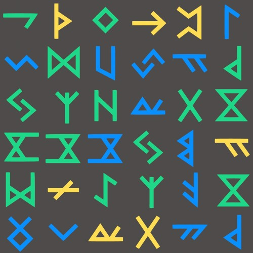{.align-middle .mr-2} **ncti** 01:16:15 /2021/ ([SC](https://soundcloud.com/shamansir/ncti?in=shamansir/sets/nct-2021))
  - {.align-middle .mr-2} **nctii feat. konstantin starostin** 02:30:00 /2023/ ([SC](https://soundcloud.com/shamansir/nctii?in=shamansir/sets/nct-2021))
### nc_ 2020 {#nc-2020}

([SC](https://soundcloud.com/shamansir/sets/nc-2020))

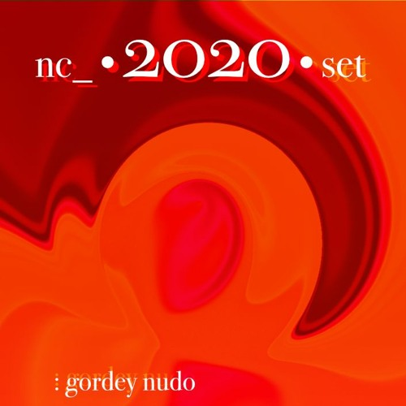

*as* shaman.sir

**Release Date**: 2020

**Length**: 09:33:17

**Tracks**:

  - 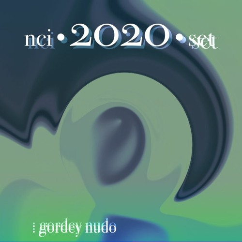{.align-middle .mr-2} **nci** 35:02 /2020/ ([SC](https://soundcloud.com/shamansir/novation-circuit-i?in=shamansir/sets/nc-2020))
  - 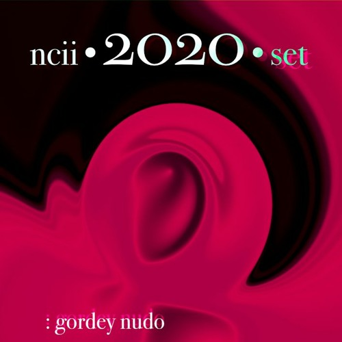{.align-middle .mr-2} **ncii** 50:15 /2020/ ([SC](https://soundcloud.com/shamansir/novation-circuit-ii?in=shamansir/sets/nc-2020))
  - 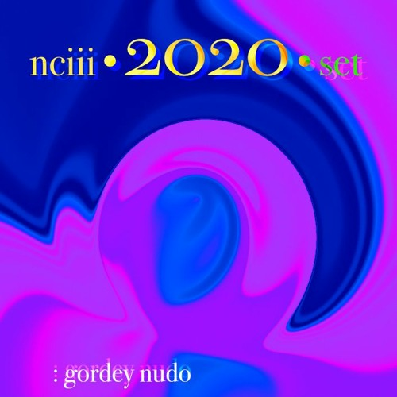{.align-middle .mr-2} **nciii** 59:58 /2020/ ([SC](https://soundcloud.com/shamansir/novation-circuit-iii?in=shamansir/sets/nc-2020))
  - {.align-middle .mr-2} **nciv** 59:58 /2020/ ([SC](https://soundcloud.com/shamansir/novation-circuit-iv?in=shamansir/sets/nc-2020))
  - 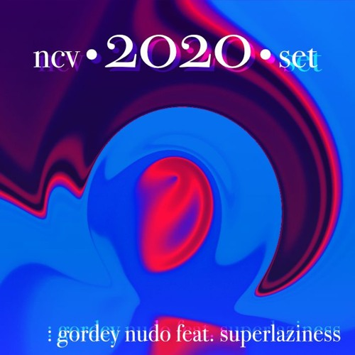{.align-middle .mr-2} **ncv ft. superlaziness** 46:44 /2020/ ([SC](https://soundcloud.com/shamansir/novation-circuit-v?in=shamansir/sets/nc-2020))
  - 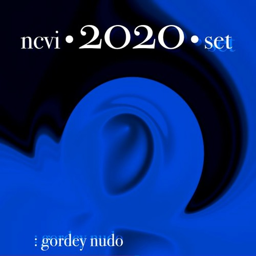{.align-middle .mr-2} **ncvi** 59:54 /2020/ ([SC](https://soundcloud.com/shamansir/novation-circuit-vi?in=shamansir/sets/nc-2020))
  - 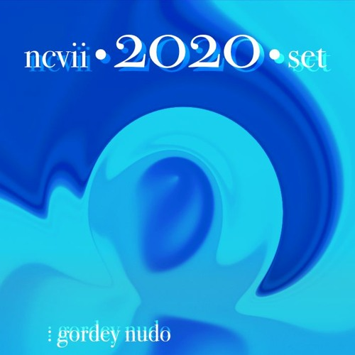{.align-middle .mr-2} **ncvii** 26:26 /2020/ ([SC](https://soundcloud.com/shamansir/novation-circuit-vii?in=shamansir/sets/nc-2020))
  - 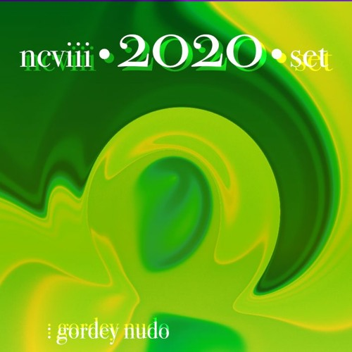{.align-middle .mr-2} **ncviii** 45:00 /2020/ ([SC](https://soundcloud.com/shamansir/novation-circuit-viii?in=shamansir/sets/nc-2020))
  - {.align-middle .mr-2} **ncix feat. konstantin starostin** 02:14:54 /2020/ ([SC](https://soundcloud.com/shamansir/novation-circuit-ix?in=shamansir/sets/nc-2020))
  - 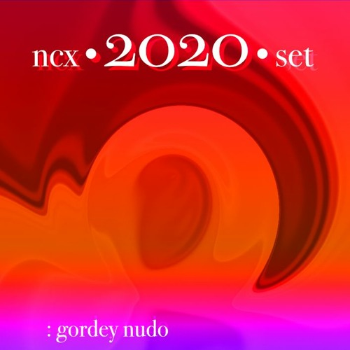{.align-middle .mr-2} **ncx** 55:06 /2020/ ([SC](https://soundcloud.com/shamansir/novation-circuit-x?in=shamansir/sets/nc-2020))
### Geeky Songs {#geeky-songs}

([SC](https://soundcloud.com/shamansir/sets/geeky-songs))

*as* shaman.sir

**Release Date**: 2020

**Length**: 11:46

**Tracks**:

  - {.align-middle .mr-2} **Javader (beta 0.18)** 01:18 /2023/ ([SC](https://soundcloud.com/shamansir/javader-b018?in=shamansir/sets/geeky-songs))
  - {.align-middle .mr-2} **Javader (backstage)** 01:35 /2023/ ([SC](https://soundcloud.com/shamansir/javader-b01?in=shamansir/sets/geeky-songs))
  - {.align-middle .mr-2} **Twitter** 03:39 /2023/ ([SC](https://soundcloud.com/shamansir/twitter?in=shamansir/sets/geeky-songs))
  - {.align-middle .mr-2} **Javader (beta 0.2)** 01:48 /2023/ ([SC](https://soundcloud.com/shamansir/javader-b02?in=shamansir/sets/geeky-songs))
  - {.align-middle .mr-2} **Про пику** 01:59 /2023/ ([SC](https://soundcloud.com/shamansir/pro-piku?in=shamansir/sets/geeky-songs))
  - 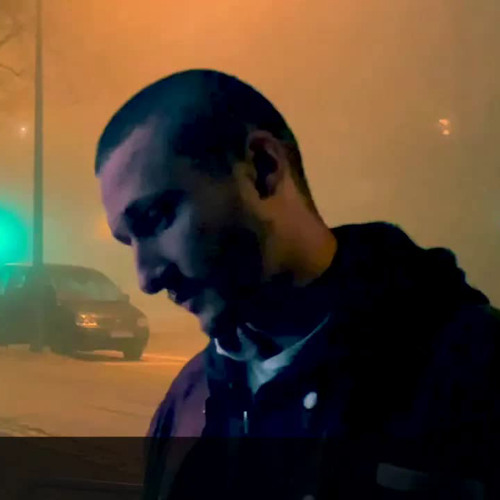{.align-middle .mr-2} **Korona** 01:27 /2023/ ([SC](https://soundcloud.com/shamansir/korona?in=shamansir/sets/geeky-songs))

### Separate Tracks
  - {.align-middle .mr-2} **Jerome** 02:39 /2023/ ([SC](https://soundcloud.com/shamansir/jerome)) *as* Elektrokiłka
  - 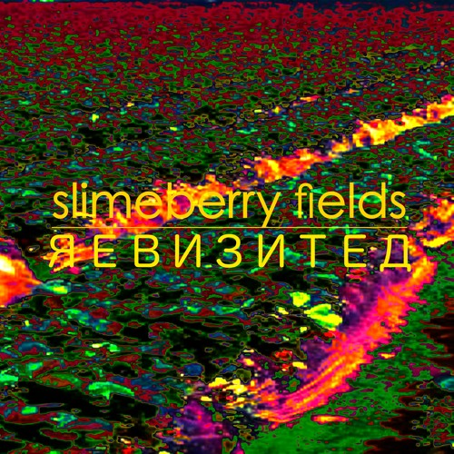{.align-middle .mr-2} **Slimeberry Fields (Revisited)** 12:03 /2023/ ([SC](https://soundcloud.com/shamansir/slimeberry-fields-revisited)) *as* Elektrokiłka
  - 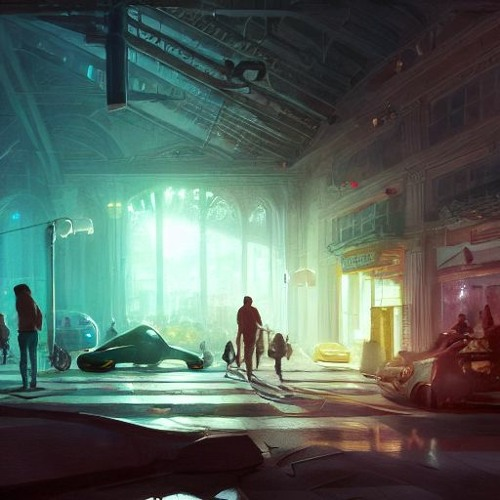{.align-middle .mr-2} **The Wonderjam (w/ Kostya Starostin)** 01:41:33 /2023/ ([SC](https://soundcloud.com/shamansir/the-wonderjam-w-kostya-starostin)) *as* Elektrokiłka
  - {.align-middle .mr-2} **Инжир** 01:00 /2024/ ([SC](https://soundcloud.com/shamansir/inzhir-v23)) *as* Elektrokiłka
  - {.align-middle .mr-2} **The Venal Spruces (Draft)** 02:25 /2019/ ([SC](https://soundcloud.com/shamansir/the-venal-spruces)) *as* shaman.sir
  - {.align-middle .mr-2} **Channel Birthday Rap** 02:22 /2019/ ([SC](https://soundcloud.com/shamansir/channel-birthday-rap)) *as* shaman.sir
  - {.align-middle .mr-2} **Pfin Freaks (Reduced)** 12:03 /2023/ ([SC](https://soundcloud.com/shamansir/pfin-freaks-reduced)) *as* Elektrokiłka