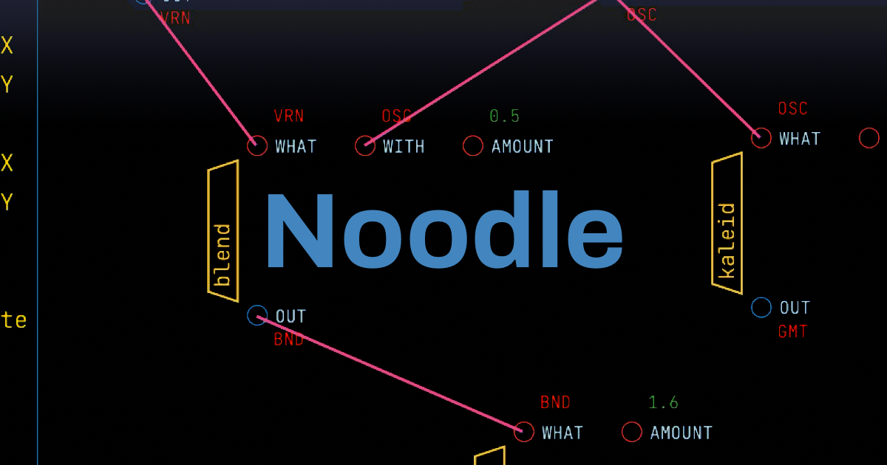
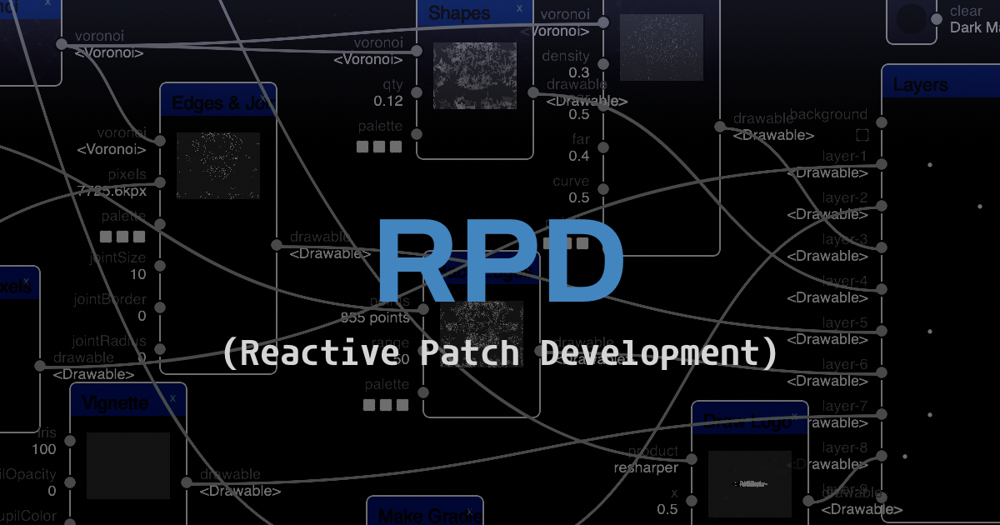
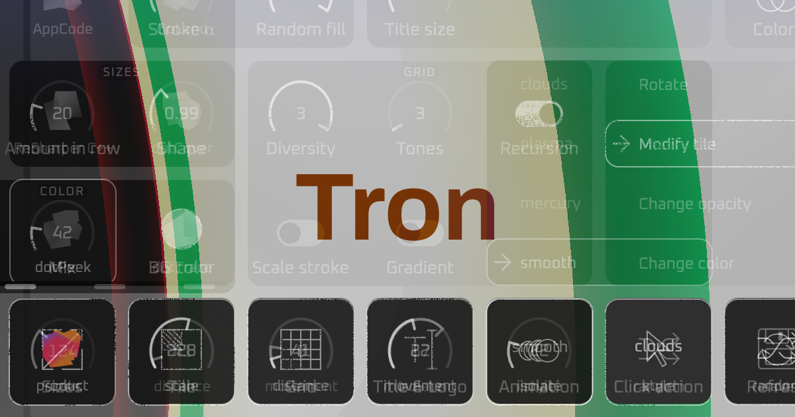
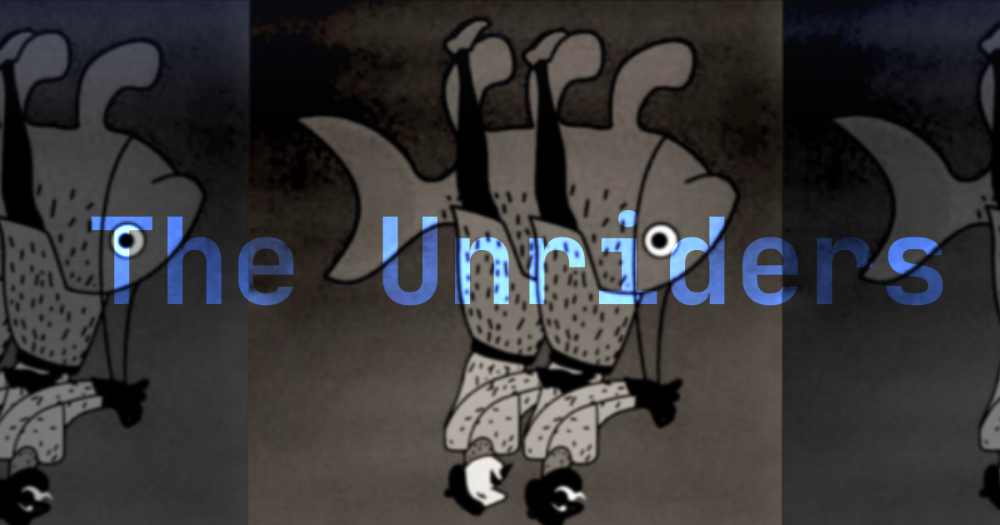

# Projects Grid

<!-- TODO: I didn't find the syntax for referencing internal page with image, invent some custom `.tpl` may be -->

|  |  |  |
| - | - | - |
|  |  | ![[Projects/assets/grid/japan-pdf.png]] |
|  |  |  |
|  | ![[Projects/assets/grid/Muenchen-Flu.png]] |  |
|  |  |  |

<!-- TRIED ALL THIS AND MORE:

![[Noodle]](Projects/assets/grid/Noodle.png)

![[Projects/assets/grid/Noodle.png][Noodle]]

[Noodle]: Projects/Noodle.org

-->
